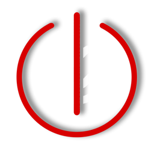
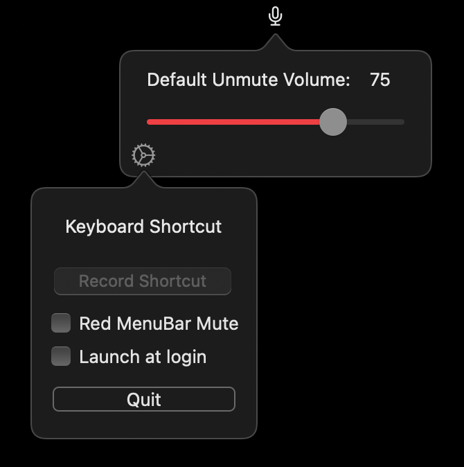
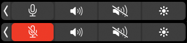

<p align="center">
   
</p>   
<h1 align="center">
   toggleMute
</h1>
<p align="center"> 
   <span>macOS Touch Bar and Menu Bar App to mute/unmute the default microphone</span>
   <br><br>
   
   
   
   
</p>

> [!Important]  
> This app only mutes or unmutes the currently selected **default audio input device** on your Mac.  
> If you use an external device, you must set it as the default input device in **System Settings → Sound** for this app to work.

## Functions
- A single tap or click on the Touch Bar or Menu Bar icon toggles between mute and unmute.  
- Right-clicking the Menu Bar icon opens settings for the default unmute volume.  
   - This volume will *always* be applied when unmuting.  
   - If you change the input volume via System Settings, the app will overwrite it.  
   - Clicking the gear icon opens additional options for a global *keyboard shortcut*, *autostart*, and a *quit* button.

## Installation

### Homebrew

```shell
brew tap satrik/togglemute
brew install togglemute
xattr -rd com.apple.quarantine /Applications/toggleMute.app
```

## Manual Installation

- Download the toggleMute.dmg file from the latest release.
   - Alternatively, you can clone or download the repository.
- Mount toggleMute.dmg and move toggleMute.app to your Applications folder.
- Run (double-click) toggleMuteDisableQuarantine.command.
   - If this doesn’t work, execute xattr -rd /Applications/toggleMute.app in the Terminal.
- Launch the app for the first time via Right-click → Open and select Trust me 😉
- The Touch Bar button is only visible in the regular “Control Strip” (not the extended version) and cannot be moved elsewhere.
   - To enable it, choose Quick Actions and activate Show Control Strip.

## Update
### Homebrew

```shell
brew update
brew updgrade
xattr -rd com.apple.quarantine /Applications/toggleMute.app
```

### Manually 
Repeat the steps from the manually install section and replace the old app

## Preview:



Touch Bar Preview:



Menubar Preview:


